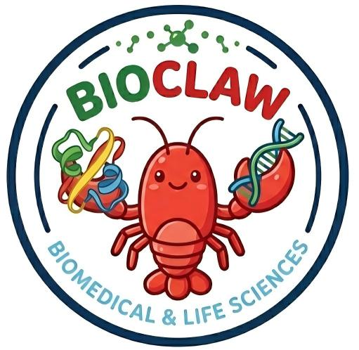

<div align="center">


# BioClaw

### 在聊天里跑生物信息学分析的 AI 助手

[English](README.md) | [简体中文](README.zh-CN.md)

[](https://github.com/Runchuan-BU/BioClaw)
[](https://github.com/Runchuan-BU/BioClaw/blob/main/LICENSE)
[](https://www.biorxiv.org/content/10.1101/2025.07.01.662467v2)
[](https://arxiv.org/abs/2507.02004)

</div>

---

## 目录

- [概览](#概览)
- [快速开始](#快速开始)
- [示例演示](#示例演示)
- [系统架构](#系统架构)
- [内置工具](#内置工具)
- [项目结构](#项目结构)
- [引用](#引用)
- [许可证](#许可证)

## 概览

BioClaw 将常见的生物信息学任务带到聊天界面中。研究者可以通过自然语言完成：

- BLAST 序列检索
- 蛋白结构渲染（PyMOL）
- 测序数据质控（FastQC / MultiQC）
- 差异分析可视化（火山图等）
- 文献检索与摘要

默认通道为 WhatsApp；也可以扩展到 QQ / 飞书（Lark）并对接 DeepSeek。

## 快速开始

> 说明：当前仓库中已经实现的消息通道是 WhatsApp。文档中的 QQ / 飞书截图展示的是扩展方向，不代表仓库里已经内置了可直接运行的 QQ / 飞书通道。

> 现在也支持一个更适合 Windows 用户的本地网页聊天入口。若你在中国、或者暂时不想接 WhatsApp，可直接走 `HTTP webhook + 本地网页聊天`。

### 环境要求

- macOS 或 Linux
- Node.js 20+
- Docker Desktop
- Anthropic API Key 或 OpenRouter API Key

### 安装

```bash
git clone https://github.com/Runchuan-BU/BioClaw.git
cd BioClaw
npm install
npm start
```

### 模型提供方配置

BioClaw 现在支持两条模型路径：

- **Anthropic**：默认路径，保留原来的 Claude Agent SDK 工作流
- **OpenRouter / OpenAI-compatible**：可选路径，适合 OpenRouter 或其他兼容 `/chat/completions` 的服务

请在项目根目录创建 `.env`，然后选择以下其中一种配置。

**方案 A：Anthropic（默认）**

```bash
ANTHROPIC_API_KEY=your_anthropic_key
```

**方案 B：OpenRouter**（支持 Gemini、DeepSeek、Claude、GPT 等）

```bash
MODEL_PROVIDER=openrouter
OPENROUTER_API_KEY=sk-or-v1-your-key
OPENROUTER_BASE_URL=https://openrouter.ai/api/v1
OPENROUTER_MODEL=deepseek/deepseek-chat-v3.1
```

常用模型 ID：`deepseek/deepseek-chat-v3.1`、`google/gemini-2.5-flash`、`anthropic/claude-3.5-sonnet`。完整列表：[openrouter.ai/models](https://openrouter.ai/models)

**注意**：请选用支持 [tool calling](https://openrouter.ai/models?supported_parameters=tools) 的模型（如 DeepSeek、Gemini、Claude）。会话历史在单次容器运行期间保留；空闲超时后新容器会以全新上下文启动。

**通用 OpenAI-compatible 配置**

```bash
MODEL_PROVIDER=openai-compatible
OPENAI_COMPATIBLE_API_KEY=your_api_key
OPENAI_COMPATIBLE_BASE_URL=https://your-provider.example/v1
OPENAI_COMPATIBLE_MODEL=your-model-name
```

修改 `.env` 后，重启 BioClaw：

```bash
npm run dev
```

容器启动后，可以通过 `docker logs <container-name>` 查看当前实际使用的是哪条 provider 路径。

### 使用

在已接入的群聊中发送：

```text
@Bioclaw <你的请求>
```

如果你在 Windows 上、或者暂时不想通过 WhatsApp 使用，请先看 [docs/WINDOWS.zh-CN.md](docs/WINDOWS.zh-CN.md)。当前最稳妥的方式是 `WSL2 + Docker Desktop + npm run cli`。

如果你想直接在浏览器里聊天，请在 `.env` 中设置 `ENABLE_WHATSAPP=false` 和 `ENABLE_LOCAL_WEB=true`，再执行 `npm run dev`，最后打开 [http://127.0.0.1:3210](http://127.0.0.1:3210)。

## 频道配置

BioClaw 支持多个聊天平台，通过 `.env` 环境变量启用。

### WhatsApp（默认）

无需额外配置。首次运行时终端会显示二维码，用 WhatsApp 扫描即可。认证状态保存在 `store/auth/`。

### 企业微信（WeCom）

1. 登录[企业微信管理后台](https://work.weixin.qq.com/wework_admin/frame)
2. 进入 **应用与小程序** > **智能机器人** > **创建**
3. 选择 **API 模式**，连接方式选 **使用长连接**（不是 URL 回调）
4. 复制 **Bot ID** 和 **Secret**
5. 添加到 `.env`：
   ```
   WECOM_BOT_ID=your-bot-id
   WECOM_SECRET=your-secret
   ```
6. 在企业微信群里添加该机器人，@ 它即可开始对话

**发送图片（可选）：** 需要在管理后台创建一个自建应用，并配置：
```
WECOM_CORP_ID=企业ID
WECOM_AGENT_ID=应用AgentId
WECOM_CORP_SECRET=应用Secret
```
服务器 IP 需加入应用的企业可信 IP 白名单。

### Discord

1. 打开 [Discord Developer Portal](https://discord.com/developers/applications)
2. 点击 **New Application**，进入 **Bot** > **Add Bot**
3. 开启 **MESSAGE CONTENT INTENT**（Privileged Gateway Intents 下）
4. 复制 **Bot Token**，添加到 `.env`：
   ```
   DISCORD_BOT_TOKEN=your-bot-token
   ```
5. 进入 **OAuth2** > **URL Generator**，勾选 scope `bot`，权限选：发送消息、附加文件、阅读消息历史
6. 打开生成的链接，将 bot 邀请到你的 Discord 服务器
7. 在任意频道发消息，bot 自动注册并回复

### 禁用某个频道

如果只想用企业微信/Discord，不启动 WhatsApp：
```
DISABLE_WHATSAPP=1
```

### Second Quick Start

如果希望更“无脑”地引导安装，给 OpenClaw 发送：

```text
install https://github.com/Runchuan-BU/BioClaw
```

## 示例演示

### QQ + DeepSeek 示例

<div align="center">

</div>

<div align="center">

</div>

### 飞书（Lark）+ DeepSeek 示例

<div align="center">

</div>

更多任务示例见 [ExampleTask/ExampleTask.md](ExampleTask/ExampleTask.md)。

> 注意：上面的 QQ / 飞书图片目前是产品展示示例，不是仓库内现成可启用的接入实现。

## 系统架构

BioClaw 基于 NanoClaw 的容器化架构，并融合 STELLA 的生物医学能力：

```
聊天平台 -> Node.js 编排器 -> SQLite 状态 -> Docker 容器 -> Agent + 生物工具
```

## 内置工具

### 命令行工具

- BLAST+
- SAMtools
- BEDTools
- BWA
- minimap2
- FastQC
- seqtk
- fastp
- MultiQC
- seqkit
- bcftools / tabix
- pigz
- sra-toolkit
- salmon / kallisto
- PyMOL

### Python 库

- BioPython
- pandas / NumPy / SciPy
- matplotlib / seaborn
- scikit-learn
- RDKit
- PyDESeq2
- scanpy
- pysam

## 项目结构

```text
BioClaw/
├── src/              # Node.js 编排器
├── container/        # Agent 镜像与运行器
├── ExampleTask/      # Demo 任务与截图
├── docs/images/      # 文档图片资源
└── README.md / README.zh-CN.md
```

## 引用

如果你在研究中使用 BioClaw，请参考英文 README 中的 Citation 条目。

## 许可证

本项目采用 MIT 许可证，详见 [LICENSE](LICENSE)。
